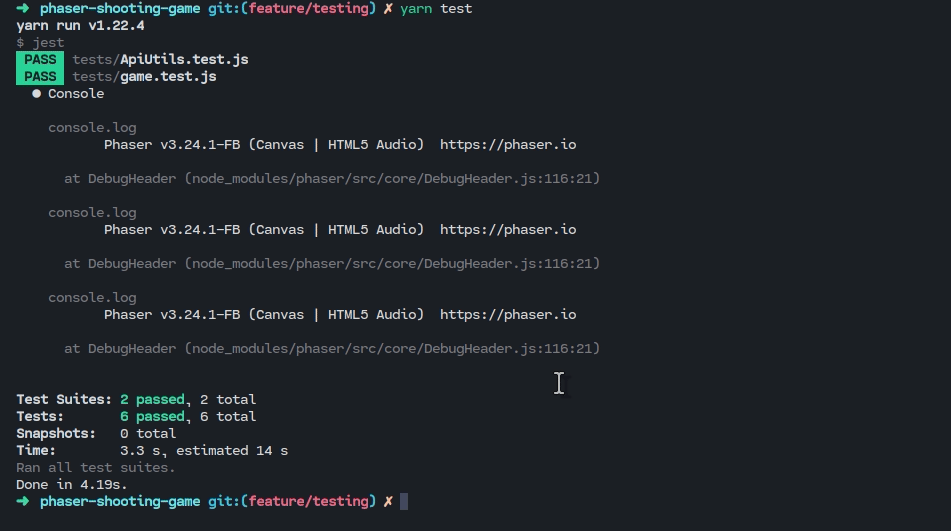

[![Contributors][contributors-shield]][contributors-url]
[![Forks][forks-shield]][forks-url]
[![Stargazers][stars-shield]][stars-url]
[![Issues][issues-shield]][issues-url]

<!-- PROJECT LOGO -->
<br />
<p align="center">
    

  <h3 align="center"> Guardian Of The Galaxies</h3>

  <p align="center">
    A Shooter Game created in the fulfillment of Microverse mandatory Javascript capstone project.
    <br />
    <a href="https://gallant-wescoff-7173eb.netlify.app">View Demo</a>
    ·
    <a href="https://github.com/Cyrus-Kiprop/phaser-shooting-game/issues">Report Bug</a>
    ·
    <a href="https://github.com/Cyrus-Kiprop/phaser-shooting-game/issues">Request Feature</a>
  </p>
</p>

<!-- TABLE OF CONTENTS -->

## Table of Contents

- [About the Project](#about-the-project)
  - [Live Demo](#live-demo)
  - [Built With](#built-with)
- [Getting Started](#getting-started)
  - [Prerequisites](#prerequisites)
  - [Installation](#installation)
- [Usage](#usage)
- [Roadmap](#roadmap)
- [Contributing](#contributing)
- [License](#license)
- [Contact](#contact)
- [Acknowledgements](#acknowledgements)

<!-- ABOUT THE PROJECT -->

## About The Project

Guardian of the Galaxy is a shooter game inspired by the guardian of the Galaxy movie. The game is browser based, and designed on the Phaser 3 game library. The game uses a collection of amazing art designed by various game designers from OpenGameArt website( Please Refer to the acknowlegment section for more Informations). The main goal of this game is to score the highest possible score, while killing invading alien ships.

 Guardian of The Galaxies

## Live Demo

Click [ here ](https://gallant-wescoff-7173eb.netlify.app) for a live demo of the app.

## Game Developement Process

The app had a five day deadline. What follows is a breakdown of how I was able to utilize the five days in delivering the game.

1. Day-one: Deep dive on Phaser-3 documentation and supplementery tutorials.
2. Day-two: Game Desing. With the help of Open Game Art webiste, I was able to reuse some of the phaser sprites and game mechanics under the free the license in exchange of acknowledging the author.
3. Third-day: I was able to start curving out the game scenes based on my sprite template.
4. Fourth-day: Finalizing on the major section of the game.
5. Testing and documenting the game.

Despite having a 5 day deadline, the time frame wasn't enough to implement all the objectives of the game, as scheduled before. Here are some of the missing functionalities:

- Game optimization for speed

I was However, able to implement the core game functionalities.

- Player, Enemy Motions and Interactions.
- Player Score
- Leader's Board using external api( which is a well curated list of the players with the best scores)
- Game audio and cool sound effects.

## Features

- Player username Input
- Leader Board listing the first 10 player with the highest score.

## Future Functionalities

- more animations.
- Player health status

## Game Instruction

| KEY   | ACTION           |
| ----- | ---------------- |
| SPACE | Shoot Enemy Ship |
| W     | Move up          |
| A     | Move Left        |
| S     | DownWard Motion  |
| D     | Right Motion     |

### Built With

The project was built using the following languages stacks:

```sh
Front-End(client)
```

- [Phaser3](https://phaser.io/phaser3)
- HTML
- JavaScript/ES6
- Webpack/babel
- [Font Awesome Icons](https://fontawesome.com/icons?d=gallery)

<!-- GETTING STARTED -->

## Getting Started

To get a local copy up and running follow these simple example steps.

### Prerequisites

- Node

- Basic knowledge of npm/yarn

### Installation

1. Clone the repo

````sh
git clone https://github.com/Cyrus-Kiprop/phaser-shooting-game

2. CD into the project root directory

```sh
cd ./phaser-shooting-game
````

3. Install Dependencies and packages

```sh
yarn
```

4. Build the files

##### Development server

```sh
yarn start
```

##### Production server

```sh
yarn build
```

<!-- USAGE EXAMPLES -->

## Usage

Check your browser

```sh
The game is served at localhost:8080
```

```JS
http//localhost:8080
```

### Enjoy the shooting game

```sh
Testing Frameworks
```

- Jest

```sh
How to test
```

The game was tested using Jest framework. The test were necessary to ensure a robust system is achieved. The api utilized by the game to get and store player score, and the game logic (player/ animation ) were some of the core targets while testing.

 $ pass

### If you like to get started on testing please run the following command

```sh
yarn test
```

<!-- ROADMAP -->

## Roadmap

See the [open issues](https://github.com/Cyrus-Kiprop/phaser-shooting-game/issues) for a list of proposed features (and known issues).

<!-- CONTRIBUTING -->

## Contributing

Contributions are what make the open source community such an amazing place to be learn, inspire, and create. Any contributions you make are **greatly appreciated**.

1. Fork the Project
2. Create your Feature Branch (`git checkout -b feature/NewAwesomeFeature`)
3. Commit your Changes (`git commit -m 'Add some NewAmazingFeature'`)
4. Push to the Branch (`git push origin feature/NewAmazingFeature`)
5. Open a Pull Request

<!-- CONTACT -->

## Contact

Cyrus Kiprop - cyruskiprop254@gmail.com

Project Link: [https://github.com/Cyrus-Kiprop/phaser-shooting-game](https://github.com/Cyrus-Kiprop/phaser-shooting-game)

## Authors

👤 **Cyrus Kiprop**

- Github: [Cyrus-Kiprop](https://github.com/Cyrus-Kiprop)
- Twitter: [@kipropJS](https://twitter.com/kipropJS)
- Linkedin: [Cyrus Kiprop](https://www.linkedin.com/in/cyrus-kiprop-ba7320120/)

## Acknowledgements

- [Font Awesome](https://fontawesome.com)
- [Best-README-Template](https://github.com/othneildrew/Best-README-Template)
- [Notion score API](https://www.notion.so/Leaderboard-API-service-24c0c3c116974ac49488d4eb0267ade3)
- [Phaser Game Template](https://phasertutorials.com/creating-a-phaser-3-template-part-1/)
- [OpenGameArt](https://opengameart.org/)
- [Shooter Game](https://learn.yorkcs.com/category/tutorials/gamedev/phaser-3/build-a-space-shooter-with-phaser-3/)

<!-- LICENSE -->

## License

Distributed under the MIT License. See [ LICENSE ](https://github.com/Cyrus-Kiprop/phaser-shooting-game/blob/master/LICENSE) for more information.

<!-- MARKDOWN LINKS & IMAGES -->

[contributors-shield]: https://img.shields.io/github/contributors/Cyrus-Kiprop/phaser-shooter-game.svg?style=flat-square
[contributors-url]: https://github.com/Cyrus-Kiprop/phaser-shooter-game/graphs/contributors
[forks-shield]: https://img.shields.io/github/forks/Cyrus-Kiprop/phaser-shooting-game.svg?style=flat-square
[forks-url]: https://github.com/Cyrus-Kiprop/phaser-shooting-game/network/members
[stars-shield]: https://img.shields.io/github/stars/Cyrus-Kiprop/phaser-shooting-game.svg?style=flat-square
[stars-url]: https://github.com/Cyrus-Kiprop/phaser-shooting-game/stargazers
[issues-shield]: https://img.shields.io/github/issues/Cyrus-Kiprop/phaser-shooting-game.svg?style=flat-square
[issues-url]: https://github.com/Cyrus-Kiprop/phaser-shooting-game/issues
[product-screenshot]: /src/assets/images/screenshot.png
